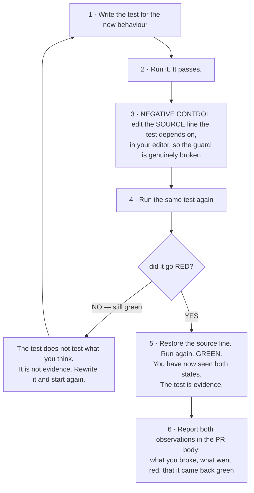

# Contributing to Taste

Taste writes files into other people's repositories and takes humans out of approval loops. That is
an unusual amount of trust for an extension, and it is the reason the conventions below are stricter
than the size of the codebase would suggest. Read the safety invariant section before you touch
`promote.ts`, `denylist.ts`, `allowlist.ts` or `gitcommit.ts`.

---

## Setup

Requires **Node >= 22** — the `engines` field enforces it, and the source uses ES2022 plus modern
`node:` built-ins throughout.

```bash
git clone https://github.com/navidRashik/taste-extension.git
cd taste-extension
npm install
```

| Script | Command | What it is for |
|---|---|---|
| `npm run typecheck` | `tsc --noEmit` | The type gate. Must be clean — zero errors, no exceptions |
| `npm test` | `vitest run` | The whole suite, `test/**/*.test.ts`, node environment |
| `npm run bundle` | esbuild → `dist/taste.js` | The single-file artefact users actually install |
| `npm run build` | `tsc` | Emits declarations into `dist/`; not the install path |

### One setup gotcha

`tsconfig.json` resolves the harness types through an absolute `paths` entry pointing at a local OMP
installation. **On any machine but the original author's, that path will not exist and `tsc` will not
find `@oh-my-pi/pi-coding-agent`.** Point it at your own install's `pi-coding-agent/dist/index.d.ts`.
Only type declarations are involved — the bundle imports nothing from the harness at runtime, and
`npm test` does not need it — so a wrong path breaks `typecheck` and nothing else.

### Testing locally against a real session

`OMP_TASTE_HOME` relocates everything Taste writes under the profile root — the rollup accumulator,
the candidates file, the promotion ledger, staged memories, and the user-scope artefact directory.
Set it to a scratch directory and you can exercise the real code paths without touching your own
`~/.omp`. The test suite relies on the same seam, which is why the suite is hermetic.

`OMP_BIN` relocates the binary the two-sided rule control shells out to.

---

## Testing convention: every behavioural change ships a negative control

A test that has never been observed to fail is not evidence. It is a line of code that returns
`true`, and there is no way to tell those apart by reading them. So the convention here is not "add a
test" — it is **add a test, then prove it can fail**.



**Break the source, not the environment.** The mutation must be an edit to the source line whose
invariant the test asserts. Do not simulate a failure by copying a file over another, running a stream
editor across the tree, checking out a different revision, or deleting a fixture. Those mutate the
*setup* and produce a red that proves nothing about the guard — the test can go red because a file went
missing rather than because the invariant broke, and you will have learned the wrong thing. Edit the
line, watch the red, put the line back.

**Where the negative control belongs in the suite itself.** Where the failure mode can be expressed as
an input rather than a source edit, encode it as a permanent test rather than a one-time manual check.
The suite already does this extensively: a runner that never fires and a runner that fires on
everything are both permanent tests of the two-sided rule control; a single strong edit is a permanent
test that the two-edit shortcut does not trip early; a hostile candidate id with traversal characters
is a permanent test that filenames are never derived from prose. Prefer that form. Fall back to the
manual source-edit control only for invariants that cannot be reached through an input — a round-trip
read-back proof being the standard example.

**No narrowed runs.** Report `npm test`, not a single-file invocation. A narrowed run reported as a
full one is a false green, and this project's guards interact across modules — the allowlist proves
itself disjoint from the denylist at import time, so a change to one can only be cleared by running
both.

---

## Comment style

Comments here carry unusual weight, because most of this codebase is ordering constraints and refusals
whose reasons are invisible from the code. The convention:

**State the invariant that holds now, in plain English.**

```ts
// GOOD — names the invariant and why it must hold
// Single-flight FIRST — a second call from within this process is a sibling
// in the same batch, not a spawned child. Checking the marker before
// single-flight would mis-classify the sibling as a child.

// BAD — describes the mechanics the code already shows
// Check the running flag, then check the env var, then set the env var.
```

Three rules:

1. **No pointers out of the file.** No ticket ids, no design-doc references, no "see the discussion
   in…". A reader has this file and nothing else. If the reason cannot be stated here, it is not yet
   understood well enough to be relied on. A few module headers still carry stale markers from the
   original build order that describe a state the code has since left behind — delete them when you
   touch the file rather than updating them.
2. **Present tense, current truth.** A comment describes what is true now, never what is planned or
   what used to be. `writers.ts` and `capture.ts` both carry honest notes about behaviour that is
   deliberately unfinished — those are fine, because they describe the *current* state accurately and
   say what the correct future change is rather than promising one.
3. **Comment the refusals hardest.** Anywhere the code declines to do something, the comment must say
   what would go wrong if it did. `stageOne` refusing a directory pathspec, `preflightAutoCommit`
   running before the write, `redact` running before `subjectOf` — every one of those looks arbitrary
   without its reason and would be "simplified" away by the next reader.

---

## The one safety invariant you must never weaken

> **Only `implementer`-class candidates auto-arm. `scope`, `behaviour` and `commitment` always take the
> human-review path. The irreversible-action denylist runs *ahead of* the class check.**

That ordering is the whole safety argument, and it is worth being explicit about why.

The class label comes from a language model. Every other gate in the system is deterministic. If the
class filter ran first, a model that mislabelled a preference about `rm -rf` as `implementer` would
carry that candidate straight to a writer, and the only thing standing between a hallucinated label
and an armed auto-approval for a destructive command would be the model's own judgement.

Running `irreversibleFamily()` first inverts the failure mode. The worst a mislabel can now do is route
something to the review queue that a human would have approved anyway. That is a failure in the safe
direction, and it is the only kind this code is allowed to have.

Concretely, in `promote()`, on the automatic path — no `approvedBy` token — this order is fixed:

1. Resolve the fingerprint subject from the rollup.
2. `irreversibleFamily(subject)` — a match returns `queued`. **First.**
3. `candidate.class !== "implementer"` — returns `queued`.
4. Only then: target support, per-target guards, write, ledger.

Things that are **not** an acceptable reason to reorder or bypass this:

- A high confidence score. Confidence measures recurrence, not reversibility.
- A human approval token. `approvedBy` bypasses the *class filter*, deliberately — but it must never
  bypass the two-sided negative control on a rule, because that control is a property of the artefact,
  not of the path that produced it. The suite pins this: an approved rule whose negative control fires
  still quarantines.
- A target that "cannot do damage". Decide that in `SUPPORTED_TARGETS` and the per-target guard, not by
  skipping the class check.

Related invariants in the same spirit, each with a load-time self-check you must keep passing:

- **`denylist.ts` entries are fingerprint-normal.** `assertDenylistWellFormed()` composes a real command
  from every entry and confirms `subjectOf()` emits the same head. An entry carrying a flag such as
  `-rf` could never match a real subject, and this check turns that silent miss into a loud import-time
  throw. Do not add an entry without running the suite.
- **`allowlist.ts` is disjoint from the denylist.** `assertAllowlistWellFormed()` refuses any entry whose
  prefix subsumes a denied family. This is why the bare `bash:git` family is absent — it would
  prefix-match `bash:git push`. Adding a convenient-looking broad entry is exactly the mistake this
  check exists to catch.
- **`gitcommit.ts` argv narrowness is enforced in the helper, not at call sites.** `assertNarrowArgv`
  runs inside the single `git()` wrapper, so it covers the probes and the staging call too. Do not add
  a call path that reaches `runner.run` directly.

Widening the denylist or narrowing the allowlist is always safe and always welcome. Movement in the
other direction needs the reasoning in the PR body, not just in the diff.

---

## The fail-open contract

Every handler registered in `index.ts` goes through `safely(label, handler)`, which:

1. **Swallows every throw**, recording it to the bounded health record. Never rethrows.
2. **Re-reads the enabled flag per call**, so the kill switch takes effect mid-session.
3. **Suppresses subagent sessions**, which have no human in them to learn from.

If you add a capture event, register it through `safely()` — registration in `index.ts`, body in
`capture.ts`. Do not add a handler that reaches `pi.on` directly, and do not add a `try`/`catch` inside
a handler body that swallows silently: the wrapper's `recordHealth` is what makes a failing install
visible in `/taste status`, and a swallow beneath it is invisible to everyone.

**Never put an error message in the health record.** Entries store a timestamp, Taste's own internal
handler label, and the error's constructor name — deliberately not `.message`, because a message can
carry a secret-bearing token such as a fetch URL with credentials or a rejected shell command line. Any
diagnostic field added later must be pushed through `redact()` first.

The same contract applies to disk reads. A malformed row must parse to `null` through the guards in
`schema.ts`, never throw. A corrupt ledger degrades Taste to "no prior promotions"; it does not crash a
session.

`/taste` is the one exception, because a human invokes it rather than the event bus. It carries its own
equivalent envelope in `command.ts` and is registered unconditionally, so a human can always read the
panel and reverse what was armed — even in a scope where learning is switched off.

---

## Pull requests

Before you open one:

- [ ] `npm run typecheck` — **zero errors.** Not "only pre-existing ones"; zero.
- [ ] `npm test` — **the full suite green.** Report the count, not a checkmark.
- [ ] **Negative control performed and reported.** Which source line you broke, which test went red,
      and that it came back green when you restored it. A behavioural change without this is not
      reviewable.
- [ ] `npm run bundle` succeeds, if you touched anything the bundle reaches.
- [ ] **Docs and diagrams updated when behaviour changed.** The mermaid diagrams in
      [README.md](README.md) and [docs/ARCHITECTURE.md](docs/ARCHITECTURE.md) are the primary
      description of this system — a promotion path or a gate that changed in code and not in the
      diagram leaves the diagram actively lying. A new promotion target changes the pipeline diagram,
      the promotion decision flowchart, the features table and the on-disk state table.
- [ ] **Nothing silenced.** No type-checker or linter suppression pragmas, and no test markers that
      skip a case or narrow the run to one. If a check is genuinely wrong here, say so in the PR *and*
      in a comment beside it, naming the invariant that makes it wrong. "It blocks the diff" is not
      that invariant.
- [ ] **No AI attribution in the commit subject.** `gitcommit.ts` enforces this on the commits Taste
      itself makes; the same standard applies to yours.

In the PR body, state which of the four invariants in
[docs/ROADMAP.md](docs/ROADMAP.md#principles-that-will-not-change) your change touches, if any. Most
changes touch none, and saying so explicitly is a two-second sentence that saves a reviewer a careful
read.

### Adding a promotion target

The most common substantial change, and the one with the most places to miss:

1. `PromotionTarget` in `schema.ts`, plus the `TARGETS` validator set.
2. `SUPPORTED_TARGETS` in `promote.ts`, and the dispatch branch.
3. `COMMITTED_TARGETS` in `gitcommit.ts` — does this artefact live in the repo and need publishing?
4. `TARGETS` in `invoker.ts`, so the summariser's reply can name it.
5. A per-target guard proportional to its blast radius. A target that removes a human from a loop needs
   a positive allowlist; a target that blocks the agent needs an empirical control.
6. `removeArtefact` in `forget.ts` — **undo is not optional.** A target you cannot reverse must not ship.
7. Tests for the writer, the guard, the promoter dispatch, and the reversal.
8. The four diagrams and two tables named above.
