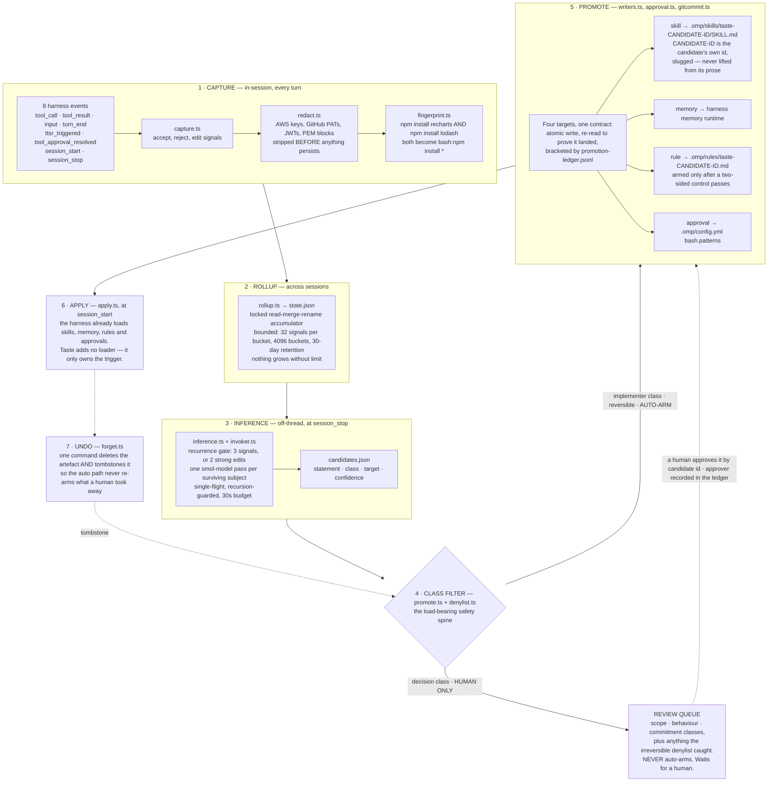
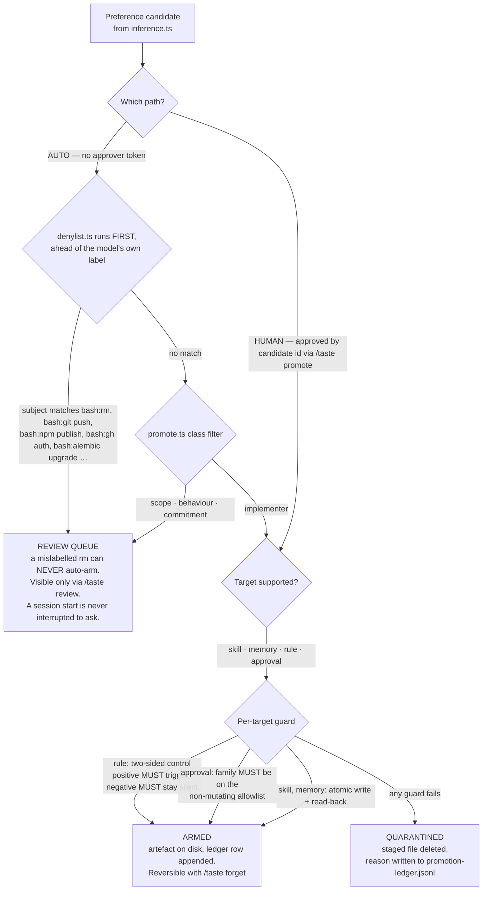
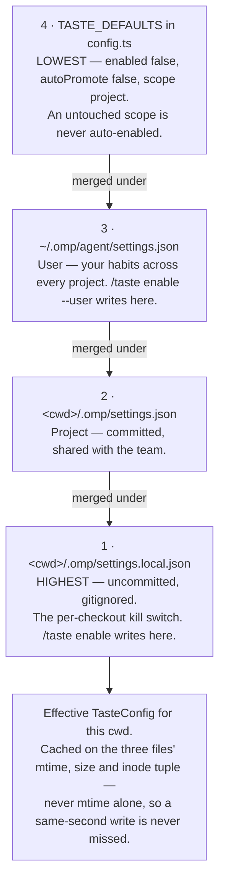

# Taste

**A preference learner for the OMP coding agent.**

Every session, the agent makes the same mistakes and you make the same corrections. It reaches for
`npm install` in a pnpm repo and you say "use pnpm". It writes a test the way you don't write tests
and you rewrite it. It asks permission to run `git status` for the hundredth time and you approve it
for the hundredth time. The harness has no memory of any of this: the correction lands, the turn
ends, and next session the agent starts from zero. Taste is the missing loop. It watches the
accept / reject / edit signals a session already emits, counts which ones keep recurring across
sessions, distils the durable preference behind them — and, **only for safe, reversible,
implementer-class preferences**, writes that preference into the harness's own machinery so the agent
stops repeating the mistake. It is default-OFF, fail-open, and everything it does is reversible with
one command.

---

## The pipeline



---

## Why you would install it

| Today, every session | With Taste armed |
|---|---|
| The agent runs `npm install` in your pnpm repo. You correct it. Next session it does it again. | Three recurrences trip the gate. A guard rule lands at `.omp/rules/taste-<candidate-id>.md` — its filename derived from the candidate's id — carrying `interruptMode: tool-only`, so the next `npm install` is caught **before the call runs**, not after. |
| You approve `git status` a hundred times because approval prompts have no memory. | `bash:git status` is on the non-mutating allowlist. An `allow` rule is appended to `.omp/config.yml` `bash.patterns` — appended last, so it can never override a `deny` or `prompt` you wrote by hand. |
| You rewrite the agent's generated test the same way twice, and it never notices. | Two strength-3 edit signals trip the strong-edit shortcut without waiting for a third recurrence. The distilled convention lands as a managed skill the catalog picks up at next session start. |
| A convention you taught the agent lives only in your head and your shell history. | A project-scope artefact is auto-committed into the repo's `.omp` subtree, so a teammate gets your learned convention with the branch, like any other file. |
| An agent that learned something wrong stays wrong. | `/taste forget <ledger-entry-id>` — the promotion id shown beside every armed entry in `/taste status` — deletes the artefact, publishes the removal, and writes a tombstone. The automatic path will never re-arm that preference again. |

---

## Features

| Feature | What it does | Source |
|---|---|---|
| Signal capture | Turns 8 harness events into typed accept / reject / edit signals in the session ledger under `sh.omp.taste.signal` | `capture.ts` |
| Secret redaction | Strips AWS keys, GitHub PATs, Slack and OpenAI-style tokens, JWTs, PEM private-key blocks and long hex/base64 blobs *before* persistence *and before* fingerprinting | `redact.ts` |
| Subject fingerprinting | Collapses arguments to `*` so recurrence counts a command *family*, not a literal — `bash:npm install *`, `edit:*.ts:describe` | `fingerprint.ts` |
| Cross-session rollup | Locked read-merge-rename JSON accumulator with a ring buffer per bucket, a seen-id dedupe set, a bucket cap and 30-day retention | `rollup.ts` |
| Pending-accept machine | A two-state machine where a later correction *cancels* the earlier suggestion's accept rather than banking it; survivors finalise at `session_stop` | `capture.ts` |
| Off-thread inference | One `omp -p --smol` pass per gated subject at `session_stop`, single-flight and recursion-guarded, so the interactive thread is never blocked | `inference.ts`, `invoker.ts` |
| Confidence decay | Raw confidence halves every 14 idle days and is cut proportionally when newer accepts contradict older rejects | `inference.ts` |
| Irreversible denylist | A deterministic, fingerprint-space denylist — `rm`, `git push`, `npm publish`, `gh auth`, `alembic upgrade`, … — that runs **ahead of** the model's class label | `denylist.ts` |
| Class filter | Only `implementer`-class candidates auto-arm. `scope`, `behaviour` and `commitment` always take the human path | `promote.ts` |
| Four promotion targets | Managed skill, memory, TTSR guard rule, tool approval — each an artefact slot the harness already reads | `writers.ts`, `approval.ts` |
| Two-sided negative control | A guard rule arms only if the offending snippet **triggers** it and a benign same-family snippet **does not**. Either side failing deletes the staged file and quarantines | `promote.ts`, `ttsr.ts` |
| Non-mutating allowlist | A standing auto-approval is a *positive* list: absence is refusal, and an entry that could prefix-match a denied family fails a load-time self-check | `allowlist.ts` |
| Promotion ledger | Append-only `promotion-ledger.jsonl` recording every promotion, quarantine, approver token and tombstone | `promote.ts`, `apply.ts` |
| Project auto-commit | Publishes a project-scope artefact with `git add -- <path>` and `git commit --only`, confined to the taste subtree, attribution-free, no push | `gitcommit.ts` |
| Session-start application | Arms last session's implementer-class candidates, skips armed / tombstoned / stale ones, surfaces what changed without interrupting the turn | `apply.ts` |
| Staleness surfacing | An armed promotion whose confidence decayed below 0.25, or whose evidence aged out, is *reported* — never silently retracted | `apply.ts` |
| Full undo | Deletes the artefact, lifts approval lines out of the shared config, publishes the removal, appends a tombstone | `forget.ts` |
| Health record | Every fail-open short-circuit is counted and shown in `/taste status`, so "learning nothing" never looks like "working fine" | `index.ts` |
| Three-layer config | Local override, project, user, built-in defaults — cached on an `(mtime, size, inode)` tuple so a mid-session kill switch takes effect with no restart | `config.ts` |

---

## Safety model

Four properties, none of them optional:

- **Default-OFF.** `TASTE_DEFAULTS` is `{ enabled: false, autoPromote: false, scope: "project" }`. A scope
  nobody switched on is never auto-enabled.
- **Fail-open.** Every event handler is wrapped by `safely()` in `index.ts`. A throw is recorded to the
  health record and swallowed. A learner that can break a session is worse than one that learns nothing.
- **Only implementer-class auto-arms.** Everything else waits for a human.
- **Full undo.** `/taste forget` reverses any promotion and tombstones it against re-arming.

Two further gates apply where the blast radius is largest: a **guard rule** must pass a two-sided
negative control before it is trusted, and an **auto-approval** must name a family on the
non-mutating allowlist — a positive list whose entries are proven at module load not to overlap the
irreversible denylist.



---

## Install

Taste is a single-file OMP extension with **zero runtime dependencies** — the bundle imports nothing
but Node built-ins.

```bash
git clone https://github.com/navidRashik/taste-extension.git
cd taste-extension
npm install
npm run bundle            # esbuild → dist/taste.js  (69 KB)

mkdir -p ~/.omp/agent/extensions
cp dist/taste.js ~/.omp/agent/extensions/
```

OMP auto-discovers any `.js` or `.ts` file in `~/.omp/agent/extensions/`; there is nothing to register.
Requires **Node >= 22**.

> Publishing to npm is planned but has not happened yet. Once it does, install becomes
> `npm i taste-extension` plus the same copy of `dist/taste.js` into the extensions directory. Until
> then, build from source.

**Uninstall** by deleting `~/.omp/agent/extensions/taste.js`. Note that removing the extension does
**not** neutralise what it already wrote — a promoted skill stays in the catalog, a guard rule stays
armed. Run `/taste forget --all` *before* uninstalling.

---

## Enable and configure

Taste ships off. Nothing is captured, inferred or written until a human switches a scope on.

```
/taste                    # status panel: what is on, armed, queued, stale, erroring
/taste enable             # opt this project in    → <cwd>/.omp/settings.local.json
/taste enable --user      # opt every project in   → ~/.omp/agent/settings.json
/taste disable            # opt out again
/taste review             # the decision-class queue and the quarantine — pulled, never pushed

/taste promote <candidate-id>
      # human approval. The candidate id is printed beside each entry by /taste review.
      # Promotes with your approver token recorded in the ledger.

/taste forget <ledger-entry-id>
      # reverse one promotion. The ledger entry id is printed beside each armed
      # promotion by /taste status.

/taste forget --all [--scope project|user]
      # reverse every armed promotion, optionally limited to one scope.
```

`/taste enable` writes `{ "taste": { "enabled": true, "autoPromote": true } }` — switching a scope on
also opts it into arming the safe, implementer-class half, which is what "learning" means once it is
on. Unrelated keys in the settings file are preserved, and a file that exists but does not parse is
refused rather than clobbered.

### Settings precedence



Each layer carries a `taste` block. Only well-typed known fields survive the read; anything else is
ignored:

```json
{
  "taste": {
    "enabled": true,
    "autoPromote": true,
    "scope": "project"
  }
}
```

**Record but never arm.** Set `"autoPromote": false` with `"enabled": true` and Taste captures signals
and infers candidates, but the session-start application path returns `not-opted-in` and writes
nothing. `/taste review` still shows you what it would have proposed.

**Disable.** `/taste disable` in the scope, or set `"enabled": false` in the local layer by hand — the
config cache is keyed on the layer files' `(mtime, size, inode)` tuple and re-read on every handler
call, so the kill switch takes effect mid-session with no restart. To unload the extension entirely,
add `"extension-module:taste"` to `disabledExtensions` in your OMP settings.

### Config reference

| Key | Type | Default | Meaning | Set it in |
|---|---|---|---|---|
| `taste.enabled` | boolean | `false` | Master switch. Off means every handler short-circuits before it does anything. | any layer; `/taste enable` writes the local layer |
| `taste.autoPromote` | boolean | `false` | Whether implementer-class candidates may arm without a prompt. `false` records signals and infers candidates but arms nothing. | any layer; `/taste enable` sets it `true` |
| `taste.scope` | `"project"` \| `"user"` | `"project"` | Where a learned artefact is written: `project` → `<cwd>/.omp`, `user` → `~/.omp/agent`. | any layer |

| Layer | File | Committed? | Use it for |
|---|---|---|---|
| Local override | `<cwd>/.omp/settings.local.json` | no, gitignored | Per-checkout kill switch; overrides everything |
| Project | `<cwd>/.omp/settings.json` | yes | A team-wide default for this repository |
| User | `~/.omp/agent/settings.json` | n/a | Your own habits across every project |
| Defaults | `TASTE_DEFAULTS` in `config.ts` | — | Off, off, project |

State Taste writes for itself lives under `~/.omp/agent/taste/`: `state.json` (the rollup
accumulator), `candidates.json` (the current inference output), `promotion-ledger.jsonl` (the
append-only audit trail) and `pending-memories/` (memory candidates staged when the harness memory
backend is off).

---

## Non-goals

- **No model training and no neural component.** Nothing is trained, fine-tuned or embedded. Inference
  is one prompt to the harness's own configured smol model, spawned through `pi.exec` in
  `invoker.ts`, whose reply must parse as a fixed-shape JSON object or be discarded. Taste's own
  "learning" is arithmetic over a bounded rollup: a recurrence count, a strong-edit shortcut, an
  exponential decay and a supersession factor.
- **No third-party schema or validation dependency.** `package.json` declares no runtime dependencies
  at all. On-disk contracts are validated by hand-written type guards in `schema.ts`, whose only job
  is to keep the fail-open posture honest — a malformed row parses to `null`, never a throw.
- **No new loader machinery.** Taste never teaches the harness to read a new kind of file. Every
  promotion target is a slot OMP already scans at session start, which is exactly why a promoted
  artefact is indistinguishable from a hand-authored one.
- **No push, and no publish.** `gitcommit.ts` refuses `push`, `--force`, `--amend`, every bulk-stage
  flag and every `--no-…` verification opt-out, at the level of the argv builder rather than the call
  site. Getting a commit to a remote stays a human or CI concern.

---

## Documentation

- [docs/ARCHITECTURE.md](docs/ARCHITECTURE.md) — how the pipeline is built, and why each safety choice exists
- [docs/ROADMAP.md](docs/ROADMAP.md) — what ships today, what is next, and the invariants that will not change
- [CONTRIBUTING.md](CONTRIBUTING.md) — dev setup, the negative-control testing convention, PR expectations
- [LICENSE](LICENSE) — MIT
