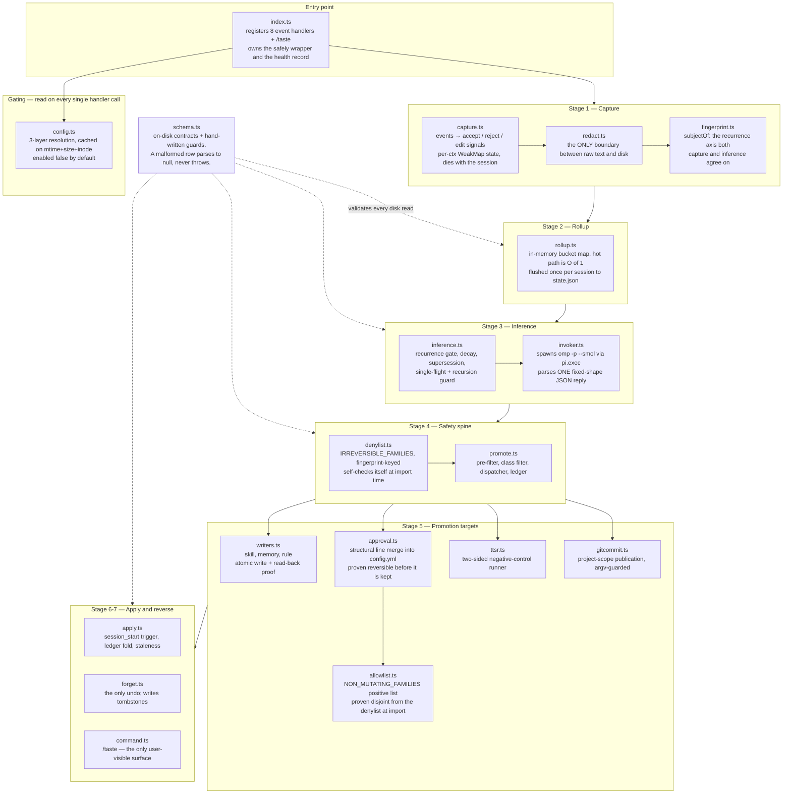
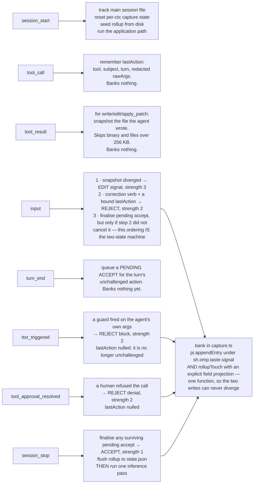
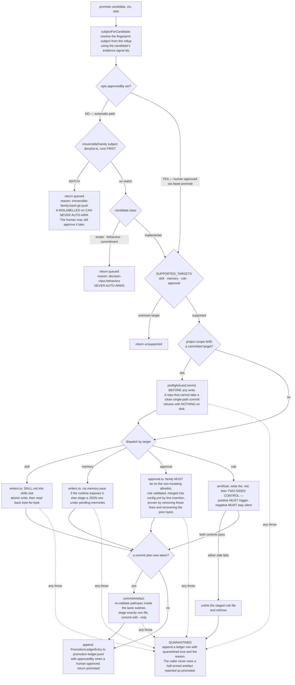
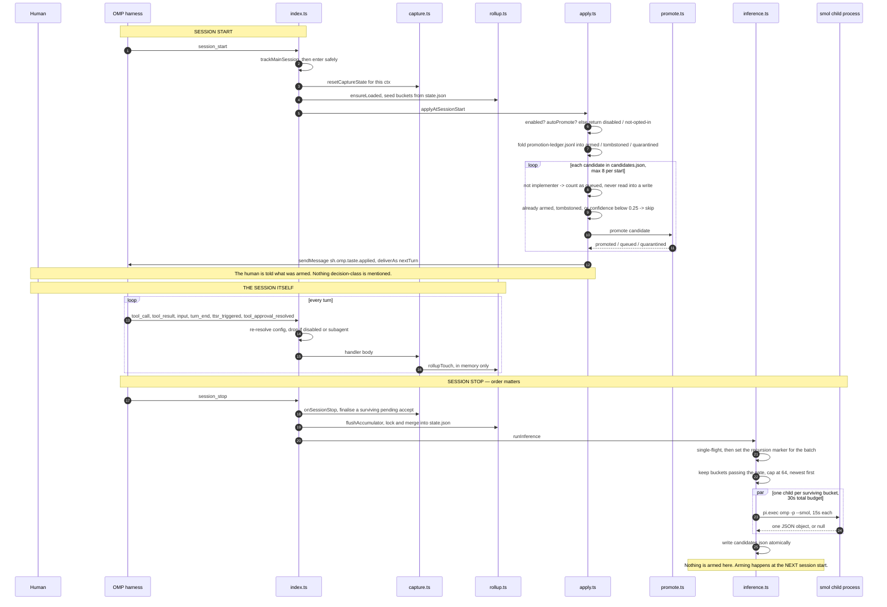
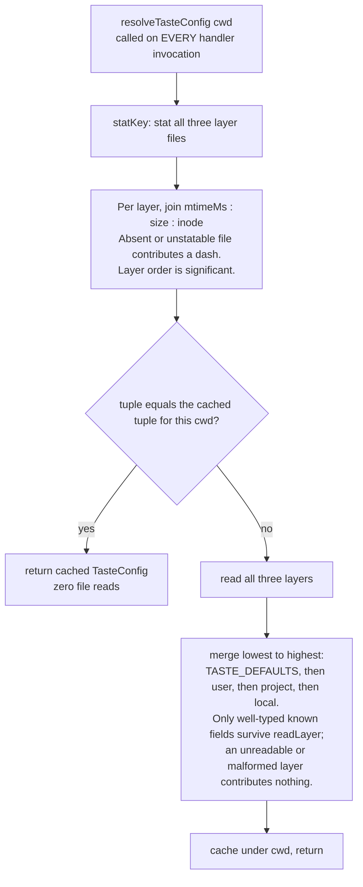
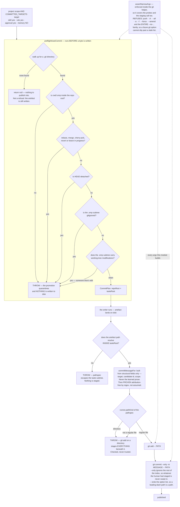
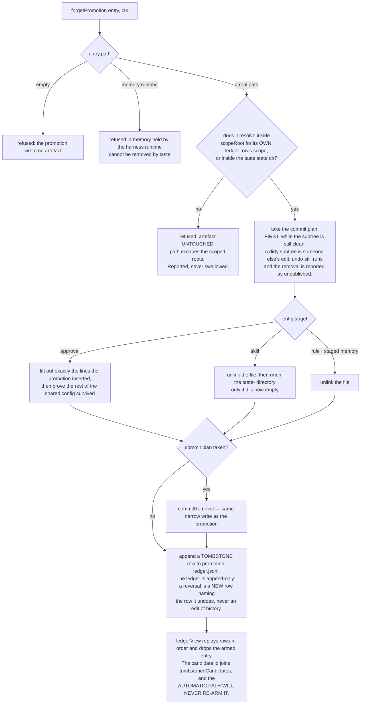

# Architecture

How Taste is built, and why each safety choice is where it is. The diagrams carry the *what*; the
prose exists to explain the *why*.

Taste is one OMP extension module. Its default export registers a handler for each of eight harness
events and one slash command, and every one of those handlers is a leaf on a very short tree: observe,
count, distil, filter, write, reverse. Nothing in it runs on the interactive thread longer than a map
lookup, and nothing in it can throw into a session.

---

## Component map



**Why `config.ts` is read on every handler call rather than once at load.** A kill switch that needs a
restart is not a kill switch. `safely()` re-resolves the config per invocation; the cost is amortised
by a cache keyed on the layer files' stat tuple, so the steady-state cost is three `statSync` calls and
a map lookup.

**Why `redact.ts` sits *upstream* of `fingerprint.ts` and not beside it.** If redaction ran after
normalisation, a token-shaped literal could survive as a substring of the subject and then be counted,
persisted and shipped into an inference prompt. Ordering it first makes "no secret reaches the subject"
a structural property rather than a review item.

---

## Stage 1 — Capture: events to signals

Eight events are registered. Only four of them ever bank a signal; the other four exist to maintain
the state the banking depends on.



**Why an accept is never banked when it is observed.** An accept is the absence of a correction, and
absence is not observable at the moment the action happens. `turn_end` therefore only *queues* it. The
next `input` runs the correction path first and the finalisation path last, so a correction arriving in
that same input **cancels** the queued accept instead of banking it alongside a contradicting reject.
`session_stop` finalises whatever survived, because a session can end before the next input ever
arrives.

**Why a subagent's signals are dropped.** A subagent session has no human in it to learn from. Its
traffic would look exactly like unchallenged agent behaviour and would inflate accept counts for
whatever the subagent happened to do. `safely()` suppresses it with a session-file-leaf predicate, and
capture state lives in a `WeakMap` keyed on the `ExtensionContext` object, so even if suppression were
bypassed a subagent could not contaminate the main session's state.

**Why the fingerprint discards the literal.** Recurrence must count a *family* of actions. `npm install
recharts` and `npm install lodash` both normalise to `bash:npm install *`; a file edit normalises to
`edit:*.ts:describe` — extension plus a construct token, never the path. Counting literals would mean
nothing ever recurs.

---

## Stage 2 — Rollup: bounded by construction

The rollup is two tiers of one shape. An in-process `globalThis` map keyed by
`(scopeHint, repo, subject)` absorbs every touch at O(1); `state.json` under `~/.omp/agent/taste/` is
written exactly once per session, at `session_stop`.

| Bound | Value | What it stops |
|---|---|---|
| `MAX_PER_BUCKET` | 32 signals, ring | A hot subject growing a bucket without limit |
| `MAX_SEEN_IDS` | 1024 ids, ring | The dedupe set outliving its usefulness |
| `MAX_BUCKETS` | 4096 | Total state size; oldest-touched are evicted first |
| `RETENTION_MS` | 30 days | Buckets nobody has touched in a month |
| `ROLLUP_SNIPPET_CAP` | 200 chars | Snippet egress into the accumulator |
| `SNAPSHOT_CAP` | 128 paths per session | An agent that writes thousands of files |
| `MAX_SNAPSHOT_BYTES` | 256 KB | Diffing a file too large to be worth diffing |
| `HUNK_CAP` | 4096 chars per side | An edit hunk ballooning the ledger |

The disk mutation is `acquire lock → read existing → merge → write temp → rename → release`. Two
sessions stopping at the same instant merge rather than clobber, because the merge unions the seen-id
sets — the same signal id touched by both peers still counts once. A crash between temp write and
rename leaves the previous good file for the next read to parse, and a lock older than 30 seconds is
broken so a crashed process cannot wedge the accumulator forever.

Compaction preserves the surviving occurrence count. Trimming a bucket's signal ring must never look
like the preference stopped recurring.

---

## Stage 3 — Inference: off the interactive thread

At `session_stop`, after the flush, `runInference` walks the rollup and keeps only buckets that pass
the recurrence gate: **3 signals**, or **2 strength-3 edits** as a shortcut, because a human rewriting
the agent's own output twice is a louder signal than three light accepts.

Each surviving bucket is sanitised into an `InferenceInput` and handed to the summariser. In production
that is `invoker.ts`, which spawns `omp -p --smol=default --mode json --no-session --no-title
--no-extensions --no-skills <prompt>` through `pi.exec` with a 15-second budget. The reply must parse
as a single JSON object carrying `statement`, a known `class` and a known `target`; anything else —
prose, a wrong enum, a timeout, a non-zero exit — yields `null` and that bucket simply produces no
candidate this pass.

Confidence is arithmetic, not model output:

```
confidence = baseConfidence(bucket)          # recurrence x strength, saturating at ~1.0 by N=3
           x 0.5 ^ (idleTime / 14 days)      # exponential decay, asymptotes to zero
           x supersessionFactor(signals)     # cut when newer accepts contradict older rejects
```

**Why the model never sets confidence.** A summariser is good at naming what a cluster of corrections
has in common and bad at knowing how much evidence there was. Recurrence, decay and supersession are
facts the rollup already holds, so they are computed here and the model is asked for one sentence and
two enums.

**Why the pass is guarded twice.** `runInference` checks its single-flight slot *before* the recursion
marker, then sets the marker once around the whole concurrent batch. Checking the marker first would
misclassify a sibling call inside the same batch as a spawned child. The child itself sees the
environment marker and short-circuits, and `--no-extensions` in the child argv is the belt to that
brace — Taste cannot recurse into itself.

**Why the whole pass is fail-open.** Every layer — load, gate, summarise, derive, persist — returns
`{ ran: false, reason }` rather than throwing. The worst outcome of a broken inference pass is that
Taste learns nothing this session.

---

## Stage 4-5 — Promotion: the decision flowchart

This is the load-bearing diagram. Everything above it is bookkeeping; everything below it writes to
disk.



### Why the denylist runs before the class check

The class label comes from a language model. The denylist does not. If the class filter ran first, a
model that mislabelled a preference about `rm -rf` as `implementer` would carry that candidate all the
way to a writer. Running a deterministic, fingerprint-keyed family check *ahead* of the label means the
worst a mislabel can do is send something to the review queue that a human would have approved anyway —
the failure is in the safe direction. `denylist.ts` covers deletion, the `git push` / `commit` / `tag`
publication family, `npm` / `pnpm` / `yarn` / `cargo publish`, credential writes such as `gh auth`,
`aws configure`, `gcloud auth` and `ssh-keygen`, and data-plane migrations such as `alembic upgrade`,
`prisma migrate` and `knex migrate`.

Entries are keyed in **fingerprint space** and the module proves it at import time:
`assertDenylistWellFormed()` composes a real command from each entry, runs it through `subjectOf()`, and
throws unless the fingerprinter emits the same head. An entry written as `bash:rm -rf` could never match
a real subject — flags are stripped during normalisation — so that class of maintainer bug fails loud
at load rather than silently never matching.

Matching is a prefix match on `<family> ` with the trailing space required. `bash:rmdir *` does not
start with `bash:rm `, so the narrowing cannot broaden to a different command, while every genuine
`bash:rm …` subject is caught — including the shapes where the fingerprinter absorbed a bare positional
word into the head.

### Why a guard rule needs a two-sided control

A guard nobody has seen fire is not a guard. Before any rule Taste writes is trusted, `ttsr.ts` shells
out to the harness's own rule tester twice:

- **Positive** — the offending snippet from the candidate's real backing evidence **must** trigger the
  rule. A rule silent on its own reason for existing is broken.
- **Negative** — a benign snippet from the same subject family **must not** trigger. A rule that fires
  on legitimate input is a liability.

Either failing deletes the staged file and quarantines. A runner fault — bad JSON, missing binary,
timeout — returns `false`, which is safe on the negative side and forces quarantine on the positive
side, so a broken runner can never arm a rule.

The negative snippet comes from the summariser, but it is only accepted if it normalises to the
*positive's* subject family under the shared fingerprinter. A control that does not belong to the
family it claims to test proves nothing, so both sides are dropped and the writer quarantines rather
than arming on synthesised proof.

Approval does not weaken this. `opts.approvedBy` bypasses the class filter, because that is what human
approval means, but it does **not** bypass the controls — the control is a safety property of the
artefact itself, not of the path that produced it.

### Why an auto-approval needs a positive list

A learned approval removes a human from the loop for every future invocation of a command family, which
is the largest blast radius of any target. `allowlist.ts` is therefore expressed positively: a family
earns auto-approval by being on the list, never by failing to be on the denylist. Absence is refusal.

`assertAllowlistWellFormed()` runs at import and catches two failure modes: an entry no real fingerprint
could match, and an entry whose prefix subsumes a denied family. That second check is why the bare
`bash:git` family is deliberately absent — it would prefix-match `bash:git push`. Only the read-only
porcelain is listed: `git status`, `git diff`, `git log`, `git show`, `git blame`.

The entry is appended to the **end** of the ordered `bash.patterns` list in the scoped `config.yml`.
First match wins, so appending guarantees a learned `allow` can never override a `deny` or `prompt` a
human wrote by hand. The merge is pure line insertion, and the write is proven both ways: the file must
read back as written, *and* removing exactly the inserted lines must recover the previous content
byte-for-byte. Either proof failing throws, and the promoter quarantines.

### Why every writer re-reads what it wrote

A write is only "done" when the artefact can be read back. `atomicWrite` is write-temp-plus-rename, so a
concurrent writer cannot leave a torn file and a crash before the rename leaves the previous good file.
The read-back is the second half: a round-trip mismatch throws, the promoter quarantines, and the
ledger records the failure. A half-written artefact never reaches the ledger claiming to be armed.

Filenames are derived from the candidate id through a traversal-proof slug, never from the candidate's
prose. The statement text originates in a human's own correction and could contain anything.

---

## Stage 6 — Session lifecycle



**Why inference runs at stop and application at start.** The pass is a summariser over the freshly
flushed rollup, so flushing first is what makes the current session count toward recurrence. Running it
after the human's last turn keeps the interactive thread free of it entirely. Application then happens
at the next start, which is also the moment the harness scans for skills, rules, memories and approval
config — so a promoted artefact is live the instant it exists, with no reload machinery of Taste's own.

**Why `applyPromotions` re-checks the class the promoter already checks.** It is an outer gate, and it
means a decision-class statement is never even *read into* a write path, let alone refused inside one.
Defence in depth costs one comparison.

**Why staleness never disarms anything.** An armed promotion whose confidence decayed below `0.25`, or
whose backing candidate aged out of the accumulator entirely, is surfaced in `/taste status` with the
exact command to reverse it. Retracting an artefact a human has been relying on is a decision only that
human may take.

---

## Config resolution and cache invalidation



**Why the identity is a triple and not just mtime.** Filesystem mtime granularity can be one second. A
settings write landing in the same second as a previous one would leave the tuple unchanged and strand
the mid-session kill switch — the single worst failure this module could have. `size` catches a
same-second content change; `inode` catches an atomic temp-file replace that reused the timestamp.

**Why a malformed layer contributes nothing rather than throwing.** This is the seam the entire learner
gates on. A JSON syntax error in a settings file must degrade Taste to its defaults, which are off, not
break the session that read it.

**Why the project toggle writes to the *local* layer.** `/taste enable` without `--user` writes
`<cwd>/.omp/settings.local.json`, the highest-precedence layer. A toggle that a committed team file
could silently outrank would not be a toggle. `/taste enable --user` writes the user layer, which
applies to every checkout that has no local override of its own.

---

## The git auto-commit safety boundary

A learned team convention only pays off if it reaches the team, so a **project-scope** artefact whose
target has a file in the repo is committed into that repo. This is the only place Taste mutates state a
human shares, so the boundary is drawn tightly.



**Why the preflight runs before the write and not after.** `git commit --only` needs the subtree to be
clean of edits Taste did not make, and the only moment that is knowable is before Taste makes one. A
repository that cannot take a clean single-path commit therefore refuses the promotion with nothing on
disk, rather than leaving an artefact the team never receives.

**Why a directory pathspec is refused explicitly.** Every other check proves the path is *inside* the
taste subtree. None of them proves what *kind* of thing it is, and `git add` given a directory stages
every file beneath it — so a writer that returned a directory would publish the whole subtree while
every existing check passed. The kind is settled at the single point staging happens.

**Why the `--no-…` family is refused wholesale.** The ones that matter switch off a repository's own
hooks and signature requirements. A learned auto-commit that can skip the checks a human commit must
pass is not a narrow write. Refusing the family rather than enumerating members also means a future git
option cannot slip past a stale list.

**Why the commit message is built from structural fields.** The learned statement is derived from a
human's own correction text and could carry anything, including an attribution token. The message is
assembled from `target`, candidate id and scope only, and is then *proven* attribution-free by regex
rather than assumed to be.

**Why a memory promotion is never committed.** It has no file in the repo — it lands in the harness's
memory runtime or in the profile state root.

---

## Stage 7 — Undo

Removing the extension does not neutralise what it wrote. A promoted skill stays in the catalog, a
guard rule stays armed, an approval entry stays in effect. Undo therefore has to actually delete the
artefact, and it has to be safe against a ledger that could name any path at all.



**Why the approval target is never deleted as a file.** Its artefact is a shared `config.yml` a human
also writes. The reversal lifts out exactly the lines the promotion inserted, mirroring how they were
added, and proves the result by read-back.

**Why every refusal is returned rather than thrown.** `/taste forget --all` must keep going and report
precisely which artefacts are still in effect and why. A throw in the middle would leave the human with
a half-finished reversal and no list.

**Why a removal that could not be published is still a removal.** The artefact is out of effect, which
is what undo promised. The unpublished state is reported, not hidden.

---

## The fail-open envelope

Every event handler goes through `safely(label, handler)` in `index.ts`, which enforces three
invariants uniformly:

1. **Fail-open** — a throw is recorded to the health record and swallowed. Never rethrown.
2. **Inert when disabled** — the enabled flag is re-read per call, so the kill switch is immediate.
3. **Main-session-only** — subagent traffic is suppressed before the handler body runs.

The health record is bounded: a rolling error count plus the 20 most recent short-circuits. Each entry
stores only a `timestamp`, Taste's own internal handler label, and the error's *constructor name* —
deliberately **not** the error message, because a message can carry a secret-bearing token such as a
fetch URL with credentials or a rejected shell command line.

`/taste status` prints that count. This matters more than it looks: a learner quietly doing nothing must
never be indistinguishable from a learner quietly failing, so the panel always names the reason for
silence — switched off here, a subagent session, nothing observed yet, or *n* handler errors.

The `/taste` command is the one exception to the envelope, because it is invoked by a human rather than
by the event bus. It carries its own equivalent: an unexpected fault is recorded to the same health
record and reported in the panel. It is also registered unconditionally, whatever the config says,
because a human must be able to read the panel — and to reverse what was already armed — in a scope
where learning is currently switched off.

---

## On-disk state

| Path | Written by | Contents |
|---|---|---|
| `~/.omp/agent/taste/state.json` | `rollup.ts` | The bucket accumulator, versioned, locked, atomically renamed |
| `~/.omp/agent/taste/candidates.json` | `inference.ts` | The current pass's candidates; rewritten wholesale each pass |
| `~/.omp/agent/taste/promotion-ledger.jsonl` | `promote.ts`, `forget.ts` | Append-only audit trail: promotions, quarantines, approver tokens, tombstones |
| `~/.omp/agent/taste/pending-memories/` | `writers.ts` | Memory candidates staged when the harness memory backend is off |
| `<cwd>/.omp/skills/taste-<candidate-id>/SKILL.md` | `writers.ts` | A managed skill, project scope |
| `<cwd>/.omp/rules/taste-<candidate-id>.md` | `writers.ts` | A TTSR guard rule, project scope |
| `<cwd>/.omp/config.yml` | `approval.ts` | One appended `bash.patterns` entry, project scope |
| `<cwd>/.omp/settings.local.json` | `command.ts` | The project opt-in written by `/taste enable` |
| `~/.omp/agent/settings.json` | `command.ts` | The user opt-in written by `/taste enable --user` |

User-scope artefacts use `~/.omp/agent/` in place of `<cwd>/.omp/` and are never committed anywhere.
Every path under the profile root honours `OMP_TASTE_HOME`, which is how the test suite stays hermetic
and how a non-standard install can relocate state.
