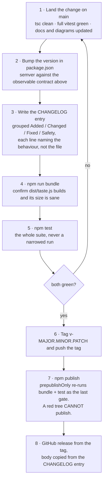
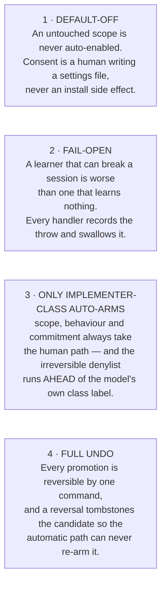

# Roadmap

Where Taste is, where it is going, and the four properties that will not change on the way there.

---

## Current state — v0.1.0

The full pipeline ships and is exercised end to end. Measured on the current tree:

| Check | Command | Result |
|---|---|---|
| Type check | `npm run typecheck` | clean, exit 0 |
| Test suite | `npm test` | **299 tests across 19 files, all passing** |
| Bundle | `npm run bundle` | `dist/taste.js`, **69.1 kb**, zero runtime dependencies |

What that covers:

- **Seven pipeline stages, all live** — capture, cross-session rollup, off-thread inference, the
  class filter and irreversible denylist, promotion, session-start application, and undo. See
  [ARCHITECTURE.md](ARCHITECTURE.md).
- **Eight harness events captured** — `session_start`, `tool_call`, `tool_result`, `input`,
  `turn_end`, `ttsr_triggered`, `tool_approval_resolved`, `session_stop`.
- **Four promotion targets, all implemented** — managed skill, memory, TTSR guard rule, tool
  approval. Each writes an artefact slot the harness already reads at start, so Taste ships no loader
  of its own.
- **Default-OFF and fail-open** — `TASTE_DEFAULTS` is `{ enabled: false, autoPromote: false, scope:
  "project" }`, and every handler is wrapped so a throw is recorded and swallowed.
- **The full safety spine** — a deterministic irreversible-family denylist ahead of the model's class
  label, an implementer-only class filter, two-sided negative controls on guard rules, a positive
  non-mutating allowlist on auto-approvals, atomic writes proven by read-back, and an append-only
  promotion ledger.
- **A complete reversal path** — `/taste forget` deletes the artefact, publishes the removal, and
  writes a tombstone the automatic path reads to know never to re-arm that preference.
- **`/taste`** with six subcommands: `status`, `enable`, `disable`, `review`, `promote`, `forget`.

Not yet released to npm. Install is from source today — see the README.

---

## Near-term

| Item | Why | Status |
|---|---|---|
| **Wire memory candidates to native retain** | `ctx.memory` is an optional runtime whose backend defaults to `off`. When it is absent, `writers.ts` stages the payload as a JSON row under `~/.omp/agent/taste/pending-memories/` so the candidate is never silently dropped — but nothing consumes that directory yet. A memory promotion on a machine with the backend off is therefore recorded and reversible, but not in effect. | Planned — staging path exists and is tested; the consumer does not |
| **In-process inference seam** | `invoker.ts` spawns `omp -p --smol` through `pi.exec` because the extension API exposes no in-process completion primitive. A subprocess costs process startup per bucket and forces the 15-second-per-child, 30-second-per-pass budgets. If the harness ever exposes an in-process smol call, the `Inferencer` type is already the seam to swap behind — nothing above it changes. | Blocked on the harness; the abstraction is in place |
| **A real review surface** | `/taste review` prints the decision-class queue and the quarantine as text lines with a `/taste promote <candidate-id>` hint. That is enough to be safe and not enough to be pleasant: there is no way to see the backing evidence, compare two candidates, or approve several at once. | Planned |
| **Promotion hit-rate telemetry** | Nothing currently answers the question the whole project rests on: *did arming this preference actually stop the recurrence?* The signal to measure it already exists — an armed subject that keeps producing rejects is a failed promotion — but nothing correlates the ledger against subsequent rollup activity. | Planned |
| **Persist and surface the health record** | The fail-open health record is in-memory and bounded to the 20 most recent short-circuits; it is lost on process exit. `/taste status` shows the count for the current process only. Flushing it to disk would make a slowly-degrading install visible across sessions. | Planned |
| **A real repository fingerprint** | Signals carry a `repo` field used to keep project-scope recurrence counts disjoint. It is currently the basename of the project directory, which satisfies same-source equality but collides between two checkouts of different repos that happen to share a directory name. A git-remote-derived fingerprint would not. | Planned |
| **A genuine user-scope hint** | Every captured signal is hinted `project` today. The user-scope axis exists throughout the rollup and the writers, but capture has no config-plus-repo plumbing to decide when a signal belongs to it, so it never fabricates one. | Planned |
| **Rule targets beyond bash** | `conditionForSubject` derives a guard condition only from a `bash:` fingerprint subject and throws — deliberately, into the quarantine handler — on anything else. A file-edit preference can become a skill or a memory today, but not a guard rule. | Planned |
| **More promotion targets** | The target set is a closed enum validated at both the schema and the dispatcher. New harness artefact slots become new targets by extending `PromotionTarget`, `SUPPORTED_TARGETS`, `COMMITTED_TARGETS` and the writer dispatch — and, for anything with a blast radius, a per-target guard on the way in. | As the harness grows |

### Explicitly not planned

- **Training anything.** See the README's non-goals. Inference stays one prompt to the harness's own
  configured smol model, and confidence stays arithmetic over the rollup.
- **Pushing to a remote.** `gitcommit.ts` refuses `push` at the argv builder. Getting a commit to a
  remote stays a human or CI concern, and that is a design decision rather than an unfinished one.
- **Auto-arming a decision-class preference under any heuristic.** No confidence threshold, no
  recurrence count, and no "the model was very sure" ever converts a `scope`, `behaviour` or
  `commitment` candidate into an automatic promotion.

---

## Development cycle

### Versioning

Semantic versioning against the **observable contract**: the `/taste` surface, the `taste` settings
block, the on-disk state shapes in `schema.ts`, and the artefacts written into a user's `.omp`
directories.

| Change | Bump |
|---|---|
| A new capture event, a new promotion target, a new subcommand or config key | **minor** |
| A behaviour fix, a widened denylist, a tightened guard | **patch** |
| A settings key renamed or removed, an on-disk state shape changed without a reader for the old one, a `/taste` subcommand removed | **major** |

Widening the irreversible denylist or narrowing the non-mutating allowlist is a **patch**: both move
in the safe direction, and neither can turn a previously refused promotion into an accepted one.

### The release gate

`prepublishOnly` is `npm run bundle && npm run test`. It is not decoration — it means a publish
physically cannot happen from a tree whose tests are red or whose bundle does not build. Do not
reach around it with `--ignore-scripts`.

### Changelog discipline

Every user-visible change gets a `CHANGELOG.md` entry in the same commit that makes it — not
retroactively at release time, when the reason has been forgotten. Entries are grouped **Added /
Changed / Fixed / Safety** and describe the *behaviour*, so a reader can tell whether an upgrade
affects them without reading the diff.

**Safety** is a first-class group rather than a subheading of Changed. Anything that touches the class
filter, the denylist, the allowlist, the negative controls or the git argv guard belongs there, so a
reader auditing what the learner is permitted to do can find every such change in one place. A
`CHANGELOG.md` is introduced with the first tagged release; there is none in the tree yet.

---

## Principles that will not change

These are invariants, not preferences. A change that weakens one is not a trade-off to be argued —
it is a different project.

Two corollaries that follow from them and are equally fixed:

- **A guard is not trusted until it has been seen to fire.** A rule arms only after its positive
  control triggers *and* its negative control stays silent. A runner fault forces quarantine rather
  than trust.
- **The audit trail is a fact on disk, not a runtime inference.** `approvedBy` is written only by the
  human-approval path, so its presence in the ledger *proves* a human approved that promotion. No
  automatic path may write it.
